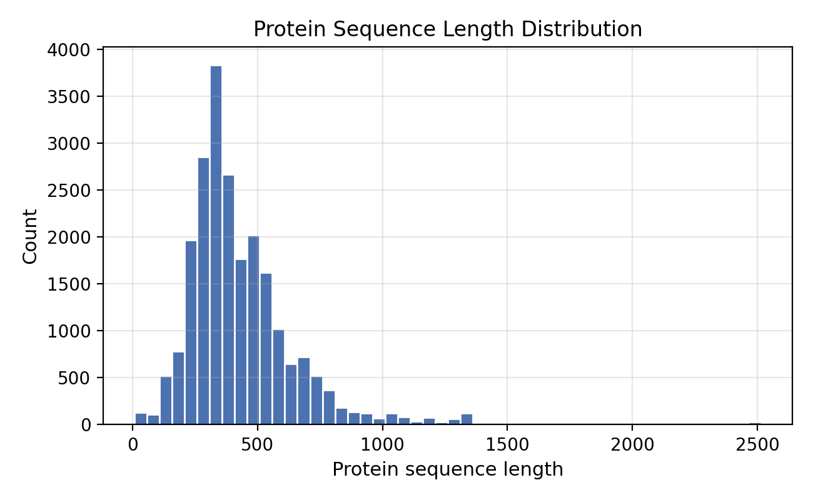
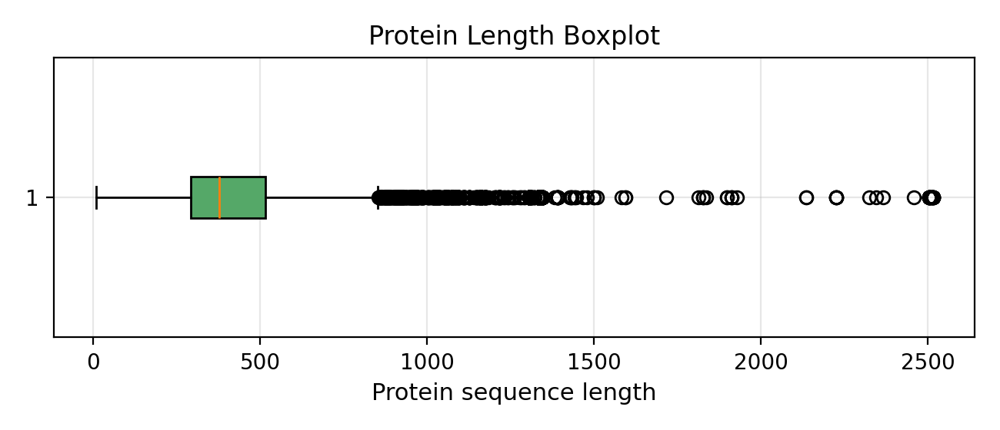
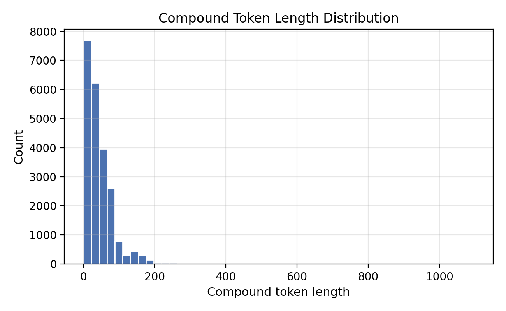
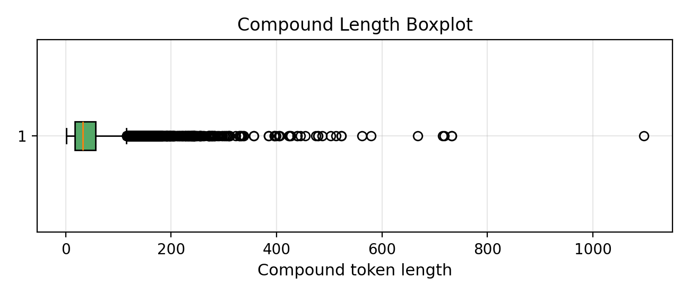
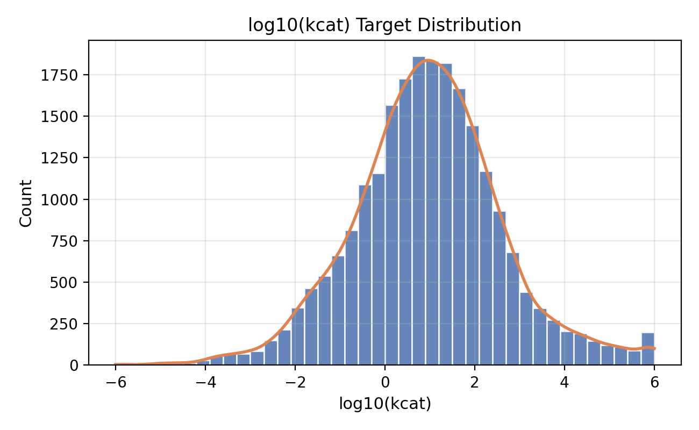
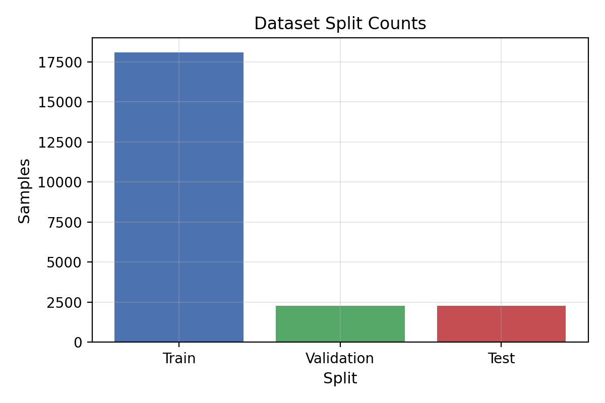

# 1. Introduction
Preprocessing and statistical inspection provide a transparent, reproducible foundation for sequence-based enzyme kinetics modeling. This report documents the dataset properties, quality controls, and the preparation steps that enable consistent experiments across runs.

# 2. Dataset Overview
The current pipeline uses the DLKcat subset from the EKP data warehouse (raw arrays in EKP_raw/DLKcat). Each sample pairs a protein token sequence with a compound token sequence and a regression target $\log_{10}(k_{cat})$.

After cleaning, the dataset contains 22632 samples. Protein sequences are stored as integer token lists with lengths ranging from 7 to 2515 (mean 431.21), and compound sequences range from 1 to 1096 tokens (mean 44.47). The target spans [-6.0, 6.0], consistent with a precomputed $\log_{10}(k_{cat})$ scale.

# 3. Data Cleaning
Cleaning is implemented in scripts/clean.py and emphasizes reproducibility and traceability:

- Duplicate removal: samples with identical protein, compound, and target are dropped.
- Empty sequence checking: zero-length protein or compound sequences are removed.
- Abnormal value filtering: targets outside [-6, 6] are discarded.
- Reproducibility settings: a fixed random seed (42) and deterministic 8/1/1 split are used during dataset partitioning.

# 4. Statistical Inspection

## 4.1 Protein Sequence Distribution

Protein lengths show a long-tailed distribution, with most sequences clustered below 600 tokens and a minority extending beyond 2000. This skew suggests that length-aware modeling or pooling is needed to avoid bias toward short sequences.

## 4.2 Compound Token Distribution

Compound token lengths are compact compared to proteins, centered around a few dozen tokens with fewer extreme outliers. This asymmetry reinforces the need for balanced fusion and normalization across modalities.

## 4.3 Target Distribution

The target distribution is centered near 1.0 with a broad spread across the full [-6, 6] range, implying substantial variability and potential heteroscedasticity. This motivates robust loss functions and calibration checks in downstream models.

## 4.4 Dataset Split

The split follows an 8/1/1 ratio with fixed random seed, yielding 18105 training samples, 2263 validation samples, and 2264 test samples. A fixed split improves reproducibility, allowing fair comparison across baseline and lightweight deep learning experiments.

# 5. Discussion
Protein lengths are markedly imbalanced, which can amplify the dominance of short sequences if pooling or truncation is not carefully designed. Target variability is wide, suggesting that models should capture both central tendencies and tail behavior. For lightweight deep learning models, pooling becomes critical: mean pooling stabilizes representation scale, while max pooling can be sensitive to sparse activations. Given the length skew, pooling strategies influence both convergence stability and predictive consistency.

# 6. Conclusion
The preprocessing pipeline produces a clean, reproducible dataset with verified sequence integrity and target ranges. Statistical inspection confirms the expected long-tailed protein lengths, compact compound lengths, and broad target variability. These findings establish readiness for reproducible experiments and motivate careful pooling and fusion choices in lightweight models.
